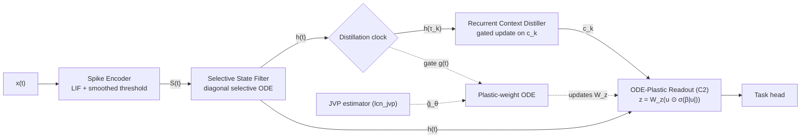

# LCN Brain — Bootstrap Blueprint

<aside>
🧠

**Audience.** An AI engineer or autonomous coding agent standing up an LCN implementation from zero.

**Goal.** A *living loop* end-to-end: spikes → SSF → RCD → plastic readout → Burgers’ 4-arm harness scores it.

**Companion docs.** [Language Cognition Network — Architecture Specification](https://www.notion.so/Language-Cognition-Network-Architecture-Specification-d7f7a71131be48ffafa17c5e3d822631?pvs=21) for theory, [§4.10 JVP micro-library + Burgers’ 4-arm harness — reference implementation (JAX)](https://www.notion.so/4-10-JVP-micro-library-Burgers-4-arm-harness-reference-implementation-JAX-ce7aea3a0d084c93820bf5c898af916a?pvs=21) for the JVP package (`lcn_jvp`).

**Read once, build linearly.** P0–P8 are strict dependencies. Each phase: (a) theory delta, (b) module code, (c) invariants, (d) acceptance probe.

</aside>

# Part I · Orientation

## §1 · Mental model

The LCN is **four subsystems in series**, **three memory substrates** at three timescales, and **one training estimator** that lives outside the forward pass.



**Three takeaways:**

1. **No attention, no KV cache.** Long-range coupling rides on $c_k$ and $W_z(t)$.
2. **No reverse traversal of the spike non-linearity.** Heaviside $\Theta$ is replaced by the Gaussian-CDF surrogate $\Phi_\sigma$ in the **forward** pass; gradients are forward-mode JVPs of that smooth surrogate. This kills Spec §3's surrogate-gradient bias chain.
3. **The clock is a compute lever.** RCD only fires on ticks, so cost is sublinear in horizon length when tick rate is bounded.

## §2 · Memory substrates

| Substrate | Symbol | Lives in | Update rule | Half-life | Plastic? |
| --- | --- | --- | --- | --- | --- |
| Working | $h(t) \in \mathbb R^D$ | SSF state | diagonal linear ODE driven by spikes | $1/a_{\min}$, ≈1–10 enc-steps | no (state) |
| Episodic | $c_k \in \mathbb R^M$ | RCD cell | gated nonlinear update at ticks | $10^2$–$10^3$ ticks | no (state) |
| Structural | $W_z(t) \in \mathbb R^{P\times(D+M)}$ | Readout weights | plastic ODE forced by $\hat g_\theta$ | $\gg 10^3$ steps | **yes** |

<aside>
💡

Working memory **decays** (kinetic), episodic memory **gates** (selective), structural memory **integrates** (cumulative). Misplacing information across substrates is the #1 architectural failure mode.

</aside>

**Substrate-selection rule.** Within ~10 enc-steps → $h$. Across ticks within an episode → $c_k$. Across episodes (a *learned* regularity) → $W_z$.

## §3 · Forward-mode AD primer

**Reverse-mode** (`jax.grad`) tapes the forward pass and walks it backward. On a spiking net the backward needs $\Theta'$, which doesn't exist; the field uses biased *surrogate gradients* whose error compounds across $T$ steps.

**Forward-mode** (`jax.jvp`) computes a directional derivative $\partial_\theta f \cdot v = \lim_{\epsilon\to0}(f(\theta+\epsilon v) - f(\theta))/\epsilon$ in one forward pass by carrying a tangent alongside every primal. Memory is $O(\text{layer width})$. Cost is ~2× a forward per direction.

**Why this saves us.** Replace $\Theta$ with $\Phi_\sigma$ in the forward pass; $\Phi'_\sigma$ exists; JVPs are honest. Spec §4.6 bounds the bias relative to the spiking limit; it shrinks with $\sigma$.

**Estimator.** $\widehat{\nabla_\theta \mathcal L_\sigma} = \frac{1}{N}\sum_n v^{(n)} (\partial_\theta \mathcal L_\sigma \cdot v^{(n)})$ with $v^{(n)} \sim \mathcal N(0, I)$. Variance falls as $1/N$. Spec §4.5 gives $N = \mathcal O((D+M)\kappa^2 L^2 t^{-2}\log)$; Proposition 2 (§4.9) sharpens this to $\bar d$ — the active dimension count.

**Antithetic sampling.** Pair $v$ with $-v$; halves variance for symmetric losses. RefImpl: `lcn_jvp.dual.antithetic`.

## §4 · Build order

| Phase | Module | Depends on |
| --- | --- | --- |
| P0 | Repo + JAX + lcn_jvp install | — |
| P1 | Spike Encoder — lcn/[encoder.py](http://encoder.py) | P0 |
| P2 | Selective State Filter — lcn/[ssf.py](http://ssf.py) | P1 |
| P3 | Distillation clock — lcn/[clock.py](http://clock.py) | P2 |
| P4 | Recurrent Context Distiller — lcn/[rcd.py](http://rcd.py) | P3 |
| P5 | ODE-Plastic Readout (C2) — lcn/[readout.py](http://readout.py) | P4 |
| P6 | Plastic-weight ODE — lcn/[plastic.py](http://plastic.py) | P5 |
| P7 | A+C training loop — lcn/[train.py](http://train.py) | P6 + lcn_jvp |
| P8 | Burgers' 4-arm testbed — lcn/testbed/[burgers.py](http://burgers.py) | P7 |

# Part II · Foundations

## §5 · Repository skeleton

```
lcn_brain/
	pyproject.toml
	README.md
	lcn/
		__init__.py
		constants.py        # §6 — single source of truth
		types.py            # State, Window dataclasses
		encoder.py          # P1
		ssf.py              # P2
		clock.py            # P3
		rcd.py              # P4
		readout.py          # P5
		plastic.py          # P6
		train.py            # P7
		diagnostics.py      # §15 logging + probes
		testbed/
			burgers.py        # P8 PDE solver
			arms.py           # 4 arm wrappers
			encodings.py      # rate code, etc.
	tests/
		test_encoder.py ... test_burgers.py
	CI/
		grep_no_grad.sh     # I1 enforcement
```

## §6 · Architectural constants

All defaults from Spec §4.4, §4.6, §4.12. Treat as immutable until acceptance (§21).

```python
# lcn/constants.py
N_ENC = 128       # LIF encoder units
D     = 64        # SSF state dim
M     = 32        # RCD episodic dim
P     = 1         # readout dim (Burgers' 1D scalar field)
SIGMA_THRESHOLD = 1e-2     # Gaussian threshold smoothing
VTHETA_INIT     = 1.0      # firing threshold
LEAK_TAU        = 5.0      # encoder time constant in steps
REFRACTORY_STEPS = 2       # soft refractory gate
A_MIN           = 0.5      # SSF: a_i(S) <= -A_MIN < 0 always
DELTA_MIN       = 2.0      # min inter-tick gap; design pressure A_MIN*DELTA_MIN >= 1
B_PARAM         = 'linear' # 'linear' | 'mlp'; Theorem 2 holds only under linear
RHO_EMA_BETA    = 0.95     # clock EMA gain
RHO_THRESHOLD0  = 0.05     # gate offset rho_0
RHO_GATE_GAIN   = 4.0      # gate sharpness gamma
U_MAX           = 1.0      # readout activation bound (enforced upstream)
BETA_0          = 6.0      # §4.12: beta_0 in [4, 8]
MU_MIN          = 0.5      # plastic ODE contraction rate when gated
MU_FREE         = 0.0      # contraction rate when free
ETA_PLASTIC     = 1e-3     # plastic ODE step size
LAMBDA_B_SPARSITY = 1e-2   # §4.11 Theorem 2 column-l21
N_JVP_DIRECTIONS = 8       # variance ~ 1/N_JVP_DIRECTIONS
DTYPE   = 'float32'
RNG_SEED = 20260426
```

<aside>
⚠️

A_MIN, U_MAX, BETA_0, DELTA_MIN are **architectural** — never trained. Spec §4.12 only severs the β-calibration circularity if these are constants of the design.

</aside>

## §7 · Numerical hygiene

- Default `float32`. Cast to `float64` only inside variance-scaling debug runs.
- All randomness flows through one `PRNGKey(RNG_SEED)`, split deterministically. Never `time.time()`. Determinism is Invariant I5.
- Wrap first 100 ticks of every new run with `jax.config.update('jax_debug_nans', True)`.
- Use `jax.scipy.stats.norm.cdf` (JVP-clean), never a hand-rolled erf.
- Soft division: `x / (norm(y) + 1e-8)` everywhere ratios appear.

# Part III · Components

## §8 · Phase 1 — Spike Encoder

**Theory.** LIF: $\dot v_i = -v_i/\tau + x_i$, $s_i = \Theta(v_i - \vartheta_i - \xi_i)$, $\xi_i \sim \mathcal N(0,\sigma^2)$. Marginalise the noise: $\bar s_i = \Phi((v_i - \vartheta_i)/\sigma)$. **This is what lives in the forward pass.** No Heaviside ever appears.

**Soft reset.** $v \leftarrow v(1 - \bar s)$. As $\sigma \to 0$, this recovers the hard reset (Spec §4.6). A hard reset would inject $\Theta$ back in.

**Refractory.** Soft multiplicative gate decaying from 0 to 1 over `REFRACTORY_STEPS`.

```python
# lcn/encoder.py
import jax
import jax.numpy as jnp
from jax.scipy.stats import norm
from .constants import N_ENC, SIGMA_THRESHOLD, VTHETA_INIT, LEAK_TAU, REFRACTORY_STEPS

def _refractory(t_since_fire, tau=REFRACTORY_STEPS):
	return 1.0 - jnp.exp(-t_since_fire / tau)

def encoder_step(carry, x_t, vtheta, sigma=SIGMA_THRESHOLD, dt=1.0):
	v_prev, t_since = carry
	v_new = v_prev + dt * (-(v_prev / LEAK_TAU) + x_t)
	refr  = _refractory(t_since)
	s     = refr * norm.cdf((v_new - vtheta) / sigma)   # in [0, 1]
	v_reset = v_new * (1.0 - s)
	t_new   = (t_since + dt) * (1.0 - s)
	return (v_reset, t_new), s

def encode_window(x_window, v0, vtheta, sigma=SIGMA_THRESHOLD):
	carry0 = (v0, jnp.full_like(v0, REFRACTORY_STEPS))
	def step(c, x_t):
		return encoder_step(c, x_t, vtheta, sigma)
	return jax.lax.scan(step, carry0, x_window)
```

**Invariants.** I-ENC-1 $s \in [0,1]$. I-ENC-2 `jax.jvp` returns finite tangents. I-ENC-3 As $\sigma\to 0$ mean rate → hard-threshold rate.

**Acceptance probe.** Sine input, $T=100$: mean rate in [0.01, 0.20], JVP finite, $|r(\sigma{=}10^{-2}) - r(\sigma{=}10^{-3})|/r \le 5\%$.

## §9 · Phase 2 — Selective State Filter (SSF)

**Theory.** Mamba-style diagonal selective ODE: $\dot h = A(S) h + B(S) S$ with $A$ diagonal and $a_i(S) \le -a_{\min} < 0$. Diagonality buys (i) parallel scan in $O(\log T)$, (ii) per-coordinate contraction (Lemma 4: $\kappa_{\mathcal Q} \le e^{-a_{\min}\Delta_k}$), (iii) spectral interpretability.

**Discretise with ZOH** (exact for the linear segment): $h_{t+1} = e^{a\Delta t} h_t + a^{-1}(e^{a\Delta t}-1) B S$.

**Floor on** $a$ (structural, not learned): $a_i(S) = -a_{\min} - \text{softplus}(W_a^i \cdot S + b_a^i)$.

$B(S)$ **parameterisation.** Start linear: $B(S) = W_B \cdot S + B_0$. Theorem 2's column-sparsity is proven only under linear $B$. MLP $B$ is open item (g) (§19).

```python
# lcn/ssf.py
import jax, jax.numpy as jnp, jax.nn as jnn
from flax import linen as nn
from .constants import D, N_ENC, A_MIN, B_PARAM

class SSFParams(nn.Module):
	hidden: int = 32
	@nn.compact
	def __call__(self, s_t):
		a_raw = nn.Dense(D, name='a_proj')(s_t)
		a_t   = -A_MIN - jnn.softplus(a_raw)
		if B_PARAM == 'linear':
			B_flat = nn.Dense(D * N_ENC, name='B_lin')(s_t)
		else:
			h = jnn.gelu(nn.Dense(self.hidden, name='B_h')(s_t))
			B_flat = nn.Dense(D * N_ENC, name='B_o')(h)
		return a_t, B_flat.reshape(D, N_ENC)

def ssf_step(h_prev, s_t, params, dt=1.0):
	a_t, B_t = params(s_t)
	decay = jnp.exp(a_t * dt)
	one_minus = -jnp.expm1(a_t * dt)
	drive = (one_minus / -a_t) * (B_t @ s_t)
	return decay * h_prev + drive, (a_t, B_t)

def run_ssf(s_window, h0, params):
	def step(h, s_t):
		h_new, aux = ssf_step(h, s_t, params)
		return h_new, (h_new, aux)
	return jax.lax.scan(step, h0, s_window)

def l21_penalty(B_traj):
	col_norms = jnp.linalg.norm(B_traj, axis=1)   # (T, N_enc)
	return col_norms.sum(axis=-1).mean()
```

**Invariants.** I-SSF-1 $a_i \le -a_{\min}$ structurally. I-SSF-2 zero input ⇒ $\|h_T\| \le \|h_0\| e^{-a_{\min}T}$. I-SSF-3 ZOH error $O(\Delta t^2)$.

**Acceptance probe.** $S\equiv 0$, $T=100$, random $h_0$: $\|h_T\| \le 1.05\|h_0\|e^{-a_{\min}T}$.

## §10 · Phase 3 — Distillation clock

**Theory.** Tick fires when $\rho(t) = \|S(t)\|_1$ exceeds an EMA-tracked threshold. The clock also drives the soft gate $g(t) = \sigma(\gamma(\bar\rho - \rho_0))$ used by the plastic ODE. Cooldown of `DELTA_MIN` steps after each tick enforces $\bar\Delta_k \ge \Delta_{\min}$.

```python
# lcn/clock.py
import jax.numpy as jnp, jax.nn as jnn
from .constants import RHO_EMA_BETA, RHO_THRESHOLD0, RHO_GATE_GAIN, DELTA_MIN

def clock_init():
	return {'rho_ema': jnp.array(RHO_THRESHOLD0), 'cooldown': jnp.array(0.0)}

def clock_step(state, s_t, dt=1.0):
	rho_t   = jnp.sum(s_t)
	rho_ema = RHO_EMA_BETA * state['rho_ema'] + (1.0 - RHO_EMA_BETA) * rho_t
	can_tick = state['cooldown'] <= 0.0
	tick = jnp.logical_and(rho_t > rho_ema, can_tick)
	cooldown_new = jnp.where(tick, jnp.array(DELTA_MIN), jnp.maximum(state['cooldown'] - dt, 0.0))
	gate = jnn.sigmoid(RHO_GATE_GAIN * (rho_ema - RHO_THRESHOLD0))
	return {'rho_ema': rho_ema, 'cooldown': cooldown_new}, tick, gate, rho_t
```

**Invariants.** I-CLK-1 $\bar\Delta_k \ge \Delta_{\min}$. I-CLK-2 tick rate sublinear in $T$, $\le 1/\Delta_{\min}$. I-CLK-3 `gate ∈ [0,1]`.

**Acceptance probe.** Poisson spikes $\lambda=0.05$, $T=1000$: tick count $< T/\Delta_{\min} = 500$, mean inter-tick gap $\ge \Delta_{\min}$.

## §11 · Phase 4 — Recurrent Context Distiller (RCD)

**Theory.** LSTM-flavored gated recurrence at ticks: $f_k = \sigma(W_f h_k + U_f c_{k-1} + b_f)$, $i_k = \sigma(W_i h_k + U_i c_{k-1})$, $\tilde c_k = \tanh(W_c h_k + U_c c_{k-1})$, $c_k = f_k \odot c_{k-1} + i_k \odot \tilde c_k$. Forget-gate bias init $b_f = 1.0$ (Jozefowicz trick) so $\sigma(b_f)\approx 0.73$ at start, encouraging retention.

```python
# lcn/rcd.py
import jax.numpy as jnp, jax.nn as jnn
from flax import linen as nn
from .constants import M

class RCDCell(nn.Module):
	@nn.compact
	def __call__(self, h_k, c_prev):
		bf = self.param('bf', nn.initializers.constant(1.0), (M,))
		f = jnn.sigmoid(nn.Dense(M, name='Wf')(h_k) + nn.Dense(M, use_bias=False, name='Uf')(c_prev) + bf)
		i = jnn.sigmoid(nn.Dense(M, name='Wi')(h_k) + nn.Dense(M, use_bias=False, name='Ui')(c_prev))
		c_tilde = jnp.tanh(nn.Dense(M, name='Wc')(h_k) + nn.Dense(M, use_bias=False, name='Uc')(c_prev))
		return f * c_prev + i * c_tilde
```

**Invariants.** I-RCD-1 $\|c_k\|_\infty \le 1$ (tanh + convex gate combo). I-RCD-2 RCD invoked **only** on ticks; CI-grep `grep -n 'RCDCell.*apply' lcn/` should find exactly one site, inside `lax.cond(tick, ...)`. I-RCD-3 forget-gate mean $\approx 0.73$ at init.

## §12 · Phase 5 — ODE-Plastic Readout (C2 gated mixture)

**Why (C2).** Spec §4.11 lists three sub-conditions (C1 sparse activation, C2 gated mixture, C3 low-rank readout). C1 fights dense $B(S)$; C3 is too restrictive at $P=1$. C2 is local to the readout.

**Form.** $u = \tanh([h; c])$ (gives $U_{\max}=1$ structurally), $z = W_z (u \odot \sigma(\beta|u|))$, $\beta = \beta_0 / (U_{\max} e^{-a_{\min}\Delta_{\min}})$.

**Worked numbers** with $a_{\min}=0.5, \Delta_{\min}=2, U_{\max}=1, \beta_0=6$: $\beta = 6e \approx 16.31$. A coordinate at $|u_j|=0.1$ is gated by $\sigma(1.63)\approx 0.836$; at $|u_j|=10^{-3}$ by $\sigma(0.016)\approx 0.504$. Sharp on active coords, suppressive on quiescent ones, JVP-clean throughout.

```python
# lcn/readout.py
import jax, jax.numpy as jnp, jax.nn as jnn
from flax import linen as nn
from .constants import D, M, P, BETA_0, U_MAX, A_MIN, DELTA_MIN

def _calibrated_beta():
	return BETA_0 / (U_MAX * jnp.exp(-A_MIN * DELTA_MIN))

def pack_u(h, c):
	return jnp.tanh(jnp.concatenate([h, c], axis=-1))

class PlasticReadout(nn.Module):
	@nn.compact
	def __call__(self, u):
		beta = _calibrated_beta()
		gate = jnn.sigmoid(beta * jnp.abs(u))
		return nn.Dense(P, name='W_z', use_bias=False)(u * gate)

def readout_pullback(W_z, u, dz):
	beta = _calibrated_beta()
	gate = jax.nn.sigmoid(beta * jnp.abs(u))
	return jnp.outer(dz, u * gate)
```

**Invariants.** I-RO-1 quiescent suppression: gate factor → 0.5 at $u_j\to0$ and grows monotonically with $|u_j|$. I-RO-2 JVP-clean (no `where` on tangents). I-RO-3 $\|z\| \le \|W_z\|_F \sqrt{D+M}$.

## §13 · Phase 6 — Plastic-weight ODE (Approach A)

**Theory.** Take $\Psi(W) = \tfrac12\|W\|_F^2$ (1-strongly convex, $\nabla_W\Psi = W$). Approach A: $\dot W_z = \hat g_\theta - \mu(t) W_z$ where $\mu(t) = \mu_{\text{free}} + (\mu_{\min}-\mu_{\text{free}}) g(t)$.

**Switched-contraction sanity.** With $g=1, \hat g=0$: $d\|W\|_F^2/dt = -2\|W\|_F^2$, so $\|W(t)\|_F = \|W_0\|_F e^{-t}$. With $g=0$: $d\|W\|_F^2/dt = 2\,\text{tr}(W^\top \hat g)$ — weights drift freely. This is exactly Lemma 4's switched contraction lifted to parameters.

```python
# lcn/plastic.py
import jax, jax.numpy as jnp, jax.nn as jnn
from .constants import ETA_PLASTIC, RHO_GATE_GAIN, RHO_THRESHOLD0, MU_FREE, MU_MIN

def gate_value(rho_ema):
	return jnn.sigmoid(RHO_GATE_GAIN * (rho_ema - RHO_THRESHOLD0))

def plastic_euler_step(W_z, g_hat, rho_ema, eta=ETA_PLASTIC):
	g_t  = gate_value(rho_ema)
	mu_t = MU_FREE + (MU_MIN - MU_FREE) * g_t
	return W_z + eta * (g_hat - mu_t * W_z)

def plastic_heun_step(W_z, g_hat, rho_ema, eta=ETA_PLASTIC):
	g_t  = gate_value(rho_ema)
	mu_t = MU_FREE + (MU_MIN - MU_FREE) * g_t
	F = lambda W: g_hat - mu_t * W
	k1 = F(W_z); W_p = W_z + eta * k1; k2 = F(W_p)
	return W_z + 0.5 * eta * (k1 + k2)
```

**Invariants.** I-PL-1 $\hat g=0, g\approx 1$: $\|W_z\|_F$ decays at rate $\mu_{\min}$. I-PL-2 free regime: $W_z$ tracks integral of $\hat g$. I-PL-3 Euler stability: `eta*MU_MIN < 2` (default 5e-4, safe).

## §14 · Phase 7 — A+C training loop

**Algorithm A+C (Spec §4.4) per tick.** (1) sample $v$, (2) form antithetic pair, (3) two forwards → central-difference tangent, (4) probe $\hat\kappa$, (5) compute active set $d_k$ (measurement-only), (6) combine via `jvp_activity`, (7) `plastic_euler_step` with `gate(rho_ema)`.

<aside>
🚫

**Invariant I6.** `active_proj` is **measurement-only**. Never multiply $v$, the antithetic pair, or the tangent by `proj` before they enter `jvp_activity`. Doing so reintroduces the §3 bias chain (Spec §4.10.2 attack B3).

</aside>

```python
# lcn/train.py
import jax, jax.numpy as jnp
from dataclasses import dataclass, replace as dc_replace
from lcn_jvp.dual import sample_direction, antithetic
from lcn_jvp.estimators import jvp_activity
from lcn_jvp.probes import column_norm_probe
from lcn_jvp.projection import active_set
from .clock import gate_value
from .plastic import plastic_euler_step
from .constants import N_JVP_DIRECTIONS, SIGMA_THRESHOLD

@dataclass
class TrainState:
	W_z: jnp.ndarray
	u_at_tick_prev: jnp.ndarray
	rho_ema: jnp.ndarray
	dh_trace: jnp.ndarray
	step: int
	def replace(self, **kw): return dc_replace(self, **kw)

def _one_dir(state, key, *, forward_fn, forward_primal_fn, pullback_fn):
	k_dir, k_jvp, _ = jax.random.split(key, 3)
	u_prev = state.u_at_tick_prev
	v = sample_direction(key=k_dir, shape=u_prev.shape, distribution='gaussian')
	pair = antithetic(u=u_prev, v=v)
	kappa_hat = column_norm_probe(forward_primal_fn=forward_primal_fn, u_tau_prev=u_prev,
	                        basis_idx=int(state.step % u_prev.shape[-1]))
	proj, d_k = active_set(dh_trace=state.dh_trace, epsilon=1e-4)   # MEASUREMENT-ONLY
	res = jvp_activity(forward_fn=forward_fn, u_tau_prev=u_prev, pair=pair,
	                   rng_key=k_jvp, smoothing_sigma=SIGMA_THRESHOLD,
	                   active_proj=proj, pullback=pullback_fn,
	                   truncation_radius=None, kappa_hat=kappa_hat,
	                   gate_value=float(gate_value(state.rho_ema)),
	                   mu_free=0.0, delta_k=1.0)
	return res, kappa_hat, d_k

def train_one_tick(state, key, *, forward_fn, forward_primal_fn, pullback_fn):
	keys = jax.random.split(key, N_JVP_DIRECTIONS)
	results = [_one_dir(state, k, forward_fn=forward_fn,
	                    forward_primal_fn=forward_primal_fn,
	                    pullback_fn=pullback_fn) for k in keys]
	g_hat   = sum(r[0].g_theta_hat for r in results) / N_JVP_DIRECTIONS
	k_mean  = jnp.mean(jnp.stack([r[1] for r in results]))
	d_mean  = jnp.mean(jnp.stack([r[2] for r in results]))
	W_new   = plastic_euler_step(state.W_z, g_hat, state.rho_ema)
	diag = {'kappa_hat': k_mean, 'd_k': d_mean,
	        'g_norm': jnp.linalg.norm(g_hat), 'W_norm': jnp.linalg.norm(W_new)}
	return state.replace(W_z=W_new, step=state.step + 1), diag
```

**Invariants** (carried from `lcn_jvp`). **I1** advisory: no `jax.grad`/`jax.vjp`/`jacrev` reachable from `lcn/` (CI grep). **I2** load-bearing: `jvp_activity` is unbiased estimator of $\nabla_\theta \mathcal L_\sigma$ — verify with 1/$\sqrt N$ regression at $N\in\{16, 64, 256, 1024\}$. **I3** empirical variance $\le$ Theorem 1* bound. **I5** determinism under fixed RNG. **I6** bit-identical with vs without `active_proj`.

## §15 · Phase 8 — Burgers' 4-arm testbed

**PDE.** Periodic 1D viscous Burgers: $u_t + u u_x = \nu u_{xx}$, $x \in [0,1)$, $N_x=64$, $\Delta t_{\text{pde}}=5\times 10^{-4}$, RK4 in time, central differences in space. CFL: $u_{\max}\Delta t/\Delta x \lesssim 1$ and $2\nu\Delta t/\Delta x^2 < 1$. ICs: 4-mode random Fourier $u_0(x) = \sum_{k=1}^4 a_k \sin(2\pi k x + \phi_k)$, $\nu \in \{10^{-2}, 10^{-3}\}$.

```python
# lcn/testbed/burgers.py
import jax, jax.numpy as jnp, functools as ft
NX = 64; DX = 1.0 / NX; DT = 5e-4

def _rhs(u, nu):
	ux  = (jnp.roll(u, -1) - jnp.roll(u, 1)) / (2 * DX)
	uxx = (jnp.roll(u, -1) - 2 * u + jnp.roll(u, 1)) / DX**2
	return -u * ux + nu * uxx

def _rk4(u, nu, dt):
	k1 = _rhs(u, nu)
	k2 = _rhs(u + 0.5*dt*k1, nu)
	k3 = _rhs(u + 0.5*dt*k2, nu)
	k4 = _rhs(u + dt*k3, nu)
	return u + (dt/6.0) * (k1 + 2*k2 + 2*k3 + k4)

@ft.partial(jax.jit, static_argnames=('n_steps',))
def simulate(u0, nu, n_steps):
	def body(u, _): return _rk4(u, nu, DT), u
	return jax.lax.scan(body, u0, None, length=n_steps)

def sample_ic(key, n_modes=4):
	k_a, k_p = jax.random.split(key)
	a   = jax.random.uniform(k_a, (n_modes,), minval=-1.0, maxval=1.0)
	phi = jax.random.uniform(k_p, (n_modes,), minval=0.0, maxval=2*jnp.pi)
	x   = jnp.linspace(0.0, 1.0, NX, endpoint=False)
	ks  = jnp.arange(1, n_modes + 1)
	return jnp.sum(a[:,None]*jnp.sin(2*jnp.pi*ks[:,None]*x[None,:] + phi[:,None]), axis=0)

def rate_code(u_field):
	up = jnp.maximum(u_field,  0.0)
	un = jnp.maximum(-u_field, 0.0)
	return jnp.stack([up, un], axis=-1).reshape(-1)   # (N_ENC,) for N_x*2 = 128
```

**4 arms.**

| Arm | Plastic update | JVP estimator | Switched contraction |
| --- | --- | --- | --- |
| BPTT_surrogate | adjoint + surrogate (external baseline) | n/a | no |
| A_only | adjoint + surrogate | n/a | yes |
| C_only | this skeleton's [plastic.py](http://plastic.py) with gate forced to 0 | yes | no |
| A_plus_C (default) | this skeleton's [plastic.py](http://plastic.py) | yes | yes |

**Falsifiers** (predictions to test at $T \in \{10, 100, 1000\}$):

- $T=10$: BPTT_surrogate wins on wall-clock.
- $T=100$: A_plus_C matches BPTT_surrogate on loss; beats C_only on variance.
- $T=1000$: A_plus_C is the only arm that converges (or fastest by ≥2×).
- Sample complexity scales with $\bar d$, not $D+M$. Linear-in-$(D+M)$ scaling would mean (R7) or (C2) failed in practice.

# Part IV · Operations

## §16 · Diagnostics — log every tick

Flat-schema Parquet, one row per tick per arm. Fields: `tau_k, rho_t, rho_ema, gate, kappa_hat, d_k, r2_violation, truncated, loss_local, W_norm, g_norm, u_max_q, u_max_a, beta_eff, arm`.

**Why each matters:**

- `kappa_hat` + `r2_violation`: persistent True during gated windows = switched contraction not engaging → variance bound breaks.
- `d_k`: Proposition 2 predicts $N \propto d_k$. If $d_k \approx D+M$ always, sparsity is gone — (R7) failed.
- `truncated`: should be rare. Frequent = tighten `JVP_TRUNCATION_RADIUS` or (C2) misconfigured.
- `u_max_q` / `u_max_a`: ratio above 0.1 means the gate isn't isolating the quiescent set.
- `beta_eff`: must be constant across run; drift = `BETA_0` accidentally trainable.

## §17 · Failure-mode taxonomy

| Symptom | Likely cause | First action |
| --- | --- | --- |
| Loss → NaN within 100 ticks | Heaviside leaked into forward pass | Grep `lcn/` for `where(.*>` and `Heaviside`. Convert to `norm.cdf`. |
| Loss flat for 1000+ ticks | Gate stuck at 0 | Plot `gate` and `rho_ema`; raise `RHO_EMA_BETA` toward 0.99. |
| Estimator variance explodes | (C2) misconfigured: β too small | Recompute β via §12 worked numbers; check `beta_eff`. |
| $d_k \approx D+M$ always | Active set never sparsifies | Increase `BETA_0` toward 8; check `u_max_q` vs `u_max_a`. |
| `r2_violation` ≈ 1 in gated windows | Approach A not engaging | Confirm `MU_MIN > 0` and `gate(rho_ema) > 0.5`. |
| Estimator differs with vs without `active_proj` | Projection used outside diagnostics | Audit `train.py`: `proj` must touch only `d_k`. |
| BPTT beats A+C at $T=1000$ | Surrogate-bias chain not yet biting | Increase $T$; bias compounds multiplicatively. |
| RCD `c_k` blows up | RCD called every encoder step | Wrap RCD apply in `lax.cond(tick, ...)`. |
| `W_norm` drifts to ∞ in free regime | No decay when gate=0 and `MU_FREE`=0 | Set `MU_FREE` to small positive (e.g. 0.01). |

## §18 · Performance & profiling

**Per encoder step:** Encoder $O(N_{\text{enc}})$, SSF $O(D N_{\text{enc}})$, Clock $O(N_{\text{enc}})$, Readout $O(P(D+M))$. **Per tick** (amortised by $1/\Delta_{\min}$): RCD $O(DM + M^2)$, JVP estimator $O(N_{\text{JVP}} \cdot \text{forward})$, plastic step $O(P(D+M))$.

**Profiling cookbook.** `jax.profiler.start_trace('/tmp/lcn')` around 1000 steps + 50 ticks. Open in TensorBoard. Confirm encoder + SSF dominate; RCD + JVP $\le 30\%$. If JVP $> 50\%$, drop `N_JVP_DIRECTIONS` to 4 and re-run the variance regression. If SSF $> 80\%$, parallel-scan-ify with `jax.lax.associative_scan`.

**XLA tip.** Never put `jax.checkpoint` across `jvp_activity` — checkpoint is reverse-mode, undefined under forward-mode.

## §19 · Open theory items (defer ok; flag in README)

- **(g)** Theorem 2 group-lasso recovery is proven only under linear $B(S)$. Under MLP $B$, RSC is non-convex; track empirical sparsity instead.
- **(i)** $\bar d$ well-definedness under non-stationary training. Spec §4.14 CUSUM partially discharges; freeze the active-set window during initial bring-up.
- **§4.15.1** Theorem 3 spectral control of $L_B$. Open. Skeleton logs `kappa_hat` for post-hoc verification.
- **(B3)** projection-misuse attack from §4.10.2. Mitigation: I6 CI test (output bit-identical with vs without `active_proj`).
- **§4.14 truncation cliff.** The Spec page truncates mid-§4.12. Update diagnostics list when the §4.x subpage migration lands.

# Part V · Closing

## §20 · Pitfalls — read before you start

1. Reaching for `jax.grad`. Breaks I1.
2. Projecting $v$ before the JVP. B3 attack.
3. Calling RCD every encoder step. Drowns compute.
4. Learning $A_{\min}$, $U_{\max}$, or $\beta_0$. Breaks §4.12 calibration.
5. Hard-Heaviside firing. Reintroduces §3 bias chain.
6. `jax.checkpoint` across `jvp_activity`. Undefined.
7. Over-tuning before P8 runs end-to-end. Get the loop closed first.
8. Skipping acceptance probes. Each catches a class of bug the next phase silently absorbs.
9. Rate-coding $u$ without sign separation — Burgers' takes both signs.
10. Sharing one `PRNGKey` across phases. Always `jax.random.split`.

## §21 · Acceptance criteria for “skeleton complete”

- [ ]  All 8 phase tests pass on a single 64×64 Burgers' instance, $\nu=10^{-2}$.
- [ ]  `train.py` runs A_plus_C for 1000 ticks with no NaN, no I1/I2/I6 violations, `r2_violation` rate $< 5\%$ in gated windows.
- [ ]  All 15 LOG_FIELDS logged per tick; Parquet parseable.
- [ ]  4-arm comparison plot for $T \in \{10, 100, 1000\}$ with at least one §15 falsifier cleanly testable.
- [ ]  No reverse-mode autograd reachable from `lcn/` (CI grep).
- [ ]  1/$\sqrt N$ variance regression passes at $N \in \{16, 64, 256, 1024\}$.
- [ ]  `beta_eff` constant across the entire run.
- [ ]  One A_plus_C episode at $T=1000$ wall-clock $< 5$ min on a single A100.

## §22 · What to build next

Do *not* start before §21 is satisfied.

1. Plasticity in SSF/RCD (Spec §4.8 nonlinear plastic gates).
2. Wire `l21_penalty` into `train.py` loss; sweep `LAMBDA_B_SPARSITY ∈ {0, 1e-3, 1e-2, 1e-1}`.
3. CUSUM tracker for $\bar d$ (Spec §4.14.1).
4. MLP $B(S)$ with (g) flagged as open.
5. Heun integrator for plastic ODE; raise `ETA_PLASTIC` 5–10×.
6. Token-quantising decoder downstream of $z(t)$ for language tasks.
7. Burgers' 2D, KdV, Navier–Stokes 2D as additional testbeds.

## §23 · Glossary

- **A+C** — the canonical training algorithm: Approach A (switched contraction) + Approach C (forward-mode JVP estimator).
- **Active set /** $d_k$ — coordinates of $u$ with non-trivial influence on $z$. Measurement-only proxy for Proposition 2's $\bar d$.
- **Antithetic pair** — paired samples $(u + \epsilon v, u - \epsilon v)$ for variance-reduced central differences.
- **β-calibration** — §4.12 procedure pinning $\beta$ via architectural constants.
- **C2** — the gated-mixture readout sub-condition of Spec §4.11.
- **Distillation tick** — clock event at which RCD updates and the plastic ODE may engage.
- **Free regime / gated regime** — phases of the plastic ODE with $g(t)\approx 0$ vs $\approx 1$.
- **JVP** — forward-mode directional derivative computed alongside the primal.
- **(R2)** — switched-contraction-engages-when-needed condition (§4.10.1).
- **(R7)** — sparsity / active-dim respecting condition (§4.10.1).
- **Surrogate gradient** — the field-standard biased reverse-mode hack the LCN explicitly avoids.
- **ZOH** — zero-order-hold discretisation. Exact for linear ODEs between sample points.

## §24 · References

- [Language Cognition Network — Architecture Specification](https://www.notion.so/Language-Cognition-Network-Architecture-Specification-d7f7a71131be48ffafa17c5e3d822631?pvs=21) — §1 lifecycle, §2 memory, §3 bottleneck, §4.1 Approach A, §4.3 Approach C, §4.4 A+C testbed, §4.6 σ envelope, §4.9 active/quiescent split, §4.10 + §4.10.1 + §4.10.2 JVP API & invariants, §4.11 (C1/C2/C3, Theorem 2), §4.12 β-calibration.
- [§4.10 JVP micro-library + Burgers’ 4-arm harness — reference implementation (JAX)](https://www.notion.so/4-10-JVP-micro-library-Burgers-4-arm-harness-reference-implementation-JAX-ce7aea3a0d084c93820bf5c898af916a?pvs=21) — vendored as `lcn_jvp`. Modules: `dual`, `rng`, `projection`, `estimators`, `probes`, `metrics`, `harness/experiment`.
- [Curriculum Lock](https://www.notion.so/Curriculum-Lock-ab3eebd6bf584465b72c3649b8e6a705?pvs=21) — current scope §4.10–§4.16.
- [Project Atlas](https://www.notion.so/Project-Atlas-00446f391aca43dcab82f0eedd242826?pvs=21) — entry point and agent roster.